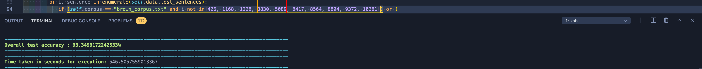

# NLP Lab Assignment 5

***Student Details:***

- Name : Anjishnu Mukherjee
- Registration Number : B05-511017020
- Exam Roll Number : 510517086
- Email : 511017020.anjishnu@students.iiests.ac.in

---

***Input files :***

1. ```demo_corpus.txt```
2. ```brown_corpus.txt```
3. ```tags_universal.txt```

***Output files :***

1. ```hmm_output.txt```
2. ```all_test_output.png```

***Code :***

1. ```dataset.py``
2. ```hmm.py```

***Prerequisites :***

1. ```pandas```
2. ```nltk```
3. ```sklearn```

---

```DEMO``` is a flag on line 9 of ```hmm.py```.
Run ```hmm.py``` with ```DEMO = True``` to run on the demo corpus, and
```DEMO = False``` to run on brown corpus. Uncomment ```hmm.test()``` in the
driver code to test on a single test sentence. Uncomment
```hmm.test_performance()``` in the driver code to test on all test sentences.
Testing on all sentences for the brown corpus takes a long time. The output of
that test is given in ```all_test_output.png``` (see image below). For the test
sentences in the brown corpus, some sentences are very long, so due to floating
point accuracy limitations, the viterbi backtracking algorithm won't be able to
execute. As per my chosen random seed and train:test split, the indices of
these test sentences are given as shown in the image below.



---

***Assignment description :***

1. Develop a hidden Markov Model(HMM) for part-of-speech (POS) tagging, using the
Brown corpus as training data. The tag set is composed of the twelve POS tags: Noun
(noun), Verb (verb), Adj (adjective), Adv (adverb), Pron (pronoun), Det (determiner or
article), Adp (preposition or postposition), Num (numeral), Conj (conjunction), Prt
(particle), ‘.’ (punctuation mark) and x (other).

2. Write a function load_corpus(path) that loads the corpus at the given path and returns it
as a list of POS-tagged sentences. Each line in the file should be treated as a separate
sentence, where sentences consist of sequences of white space-separated strings of the
form “token = POS”. Your function should return a list of lists, with individual entries
being 2-tuples of the form (token, POS).

3. Write an initialization method which takes a list of sentences in the form produced by
load_corpus(path) as input and initializes the internal variables needed for the POS
tagger. In particular, if t1, t2, t3,..., tn denotes the set of tags and
w1,w2,w3,...,wn denotes the set of tokens found in the input sentences,
compute the following:

  - The initial tag probabilities π(ti) for 1<i< n, where π(ti) is the probability that a
  sentence begins with tag ti.

  - The transition probabilities a(ti →tj) for 1<(i, j)<n where a(ti →tj) is the
  probability that tag tj occurs after tag ti.

  - The emission probabilities b(ti →wj) for 1<i< n and 1<j< n where b(ti →wj) is the
  probability that token wj is generated given tag ti.

4. Write a method most_propable_tags(Words, HMM_Parameter) which returns the list of
the most probable tags corresponding to each input word-token. In particular, the most
probable tag for a token, wj is defined to be the tag with index i*=argmaxi b(ti→wj).
Computation will likely proceed in two stages: you will first compute the probability of
the most likely tag sequence, and will then reconstruct the sequence which achieves that
probability from end to beginning by tracing backpointers.

---
